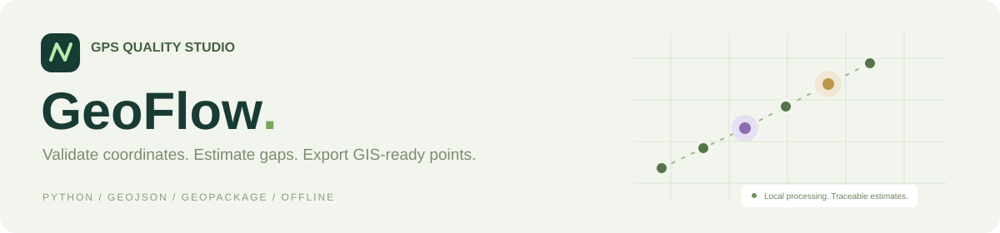

<div align="center">

# Muhammad Kamran

### Associate Data Analyst · Geospatial & Data Engineering · Python Automation

Building practical tools that turn **spatial, operational, and raw data** into reliable workflows, dashboards, and applications.

[](https://www.linkedin.com/in/kamranak4142)
[](https://github.com/kamranak4142)

</div>

---

## 👨‍💻 About Me

I'm a **Computer Science graduate and Associate Data Analyst** focused on geospatial data, automation, data engineering, analytics, and practical software tools.

My work combines **Python, SQL, GIS, spatial analysis, data pipelines, dashboards, and web mapping** to solve real-world data problems—from processing and validating large spatial datasets to building tools that make complex workflows easier to use.

- 🗺️ **GIS & Geospatial:** QGIS, ArcGIS Pro, GeoPandas, KML, GeoJSON, GeoPackage
- 🐍 **Data & Automation:** Python, Pandas, NumPy, OpenCV
- 🗄️ **Databases:** SQL Server, MySQL, ClickHouse
- ⚙️ **Data Engineering:** Apache Airflow, Spark, ETL workflows
- 📊 **Analytics:** Grafana, Apache Superset, Power BI
- 🌐 **Web & Mapping:** TypeScript, JavaScript, Leaflet, React, Vite
- 👁️ **Computer Vision / OCR:** PaddleOCR, UTRNet, OpenCV

---

## 🧰 Core Technology Stack

<div align="center">

### Data · Programming · Automation


### GIS · Spatial


### Engineering · Web · Analytics


</div>

---

## 🚀 Public Project

### [GeoFlow · GPS Quality Studio](https://github.com/kamranak4142/kamranak4142/tree/main/projects/geoflow)

[](https://github.com/kamranak4142/kamranak4142/tree/main/projects/geoflow)

A local workspace for validating CSV coordinates, estimating eligible GPS gaps with a complete audit trail, and exporting **GeoJSON** or **GeoPackage** point layers.

**Python · SQLite · JavaScript** · Responsive dashboard and CLI · Synthetic examples · Automated tests

[View the project and screenshots →](https://github.com/kamranak4142/kamranak4142/tree/main/projects/geoflow)

---

## 🎯 What I Build

```text
Geospatial processing     → CRS, geometry, joins, KML/GeoJSON/GPKG workflows
Data automation           → validation, transformation, ETL and repeatable pipelines
Spatial applications      → interactive maps, layer comparison and asset tools
Analytics systems         → SQL-backed dashboards and operational reporting
Computer vision / OCR     → structured data extraction from images and documents
```

---

## 🤝 Let's Connect

I'm interested in opportunities and collaborations involving **GIS, geospatial analytics, Python automation, data engineering, data analytics, and spatial web applications**.

<div align="center">

[](https://www.linkedin.com/in/kamranak4142)

</div>
