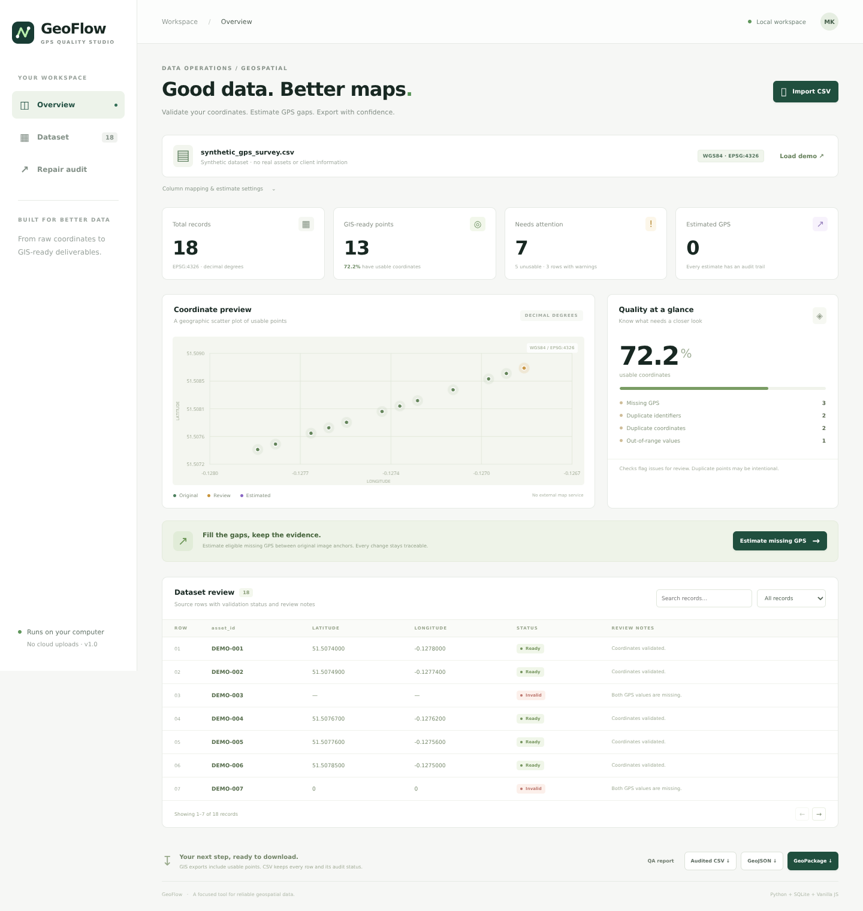
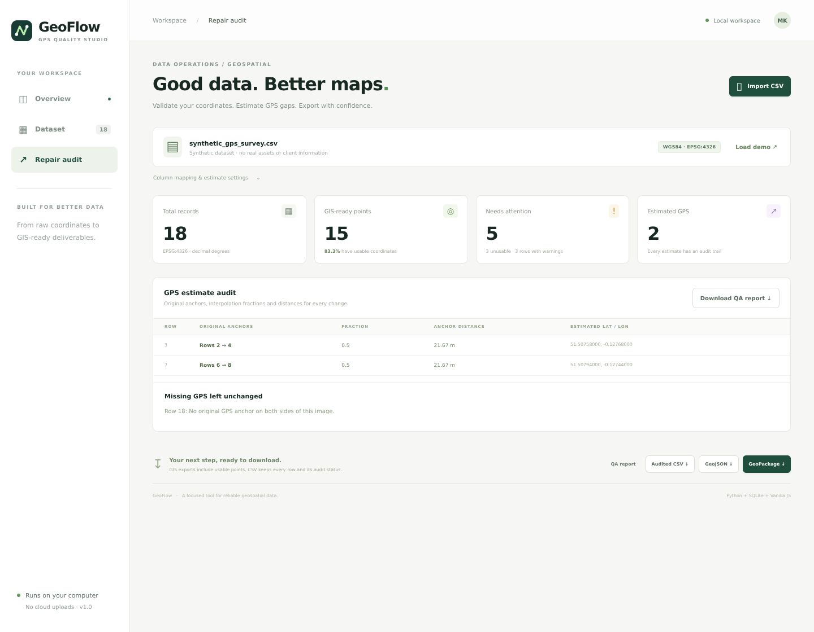

<p align="center"></p>

# GeoFlow · GPS Quality Studio

**A local workspace that turns a CSV of GPS readings into reviewed, traceable GIS deliverables.**

GeoFlow finds coordinate errors, estimates eligible missing GPS readings between original image anchors, and exports usable points as **GeoJSON** or **GeoPackage**. A responsive dashboard and command-line interface share the same processing engine.

Built by **Muhammad Kamran** with Python, SQLite and vanilla JavaScript. The app runs without third-party Python packages, API keys, external map tiles or cloud services.



## Why this project exists

Image collections and asset CSVs can contain blank coordinates, `(0,0)` placeholders, duplicate identifiers, or values that cannot be plotted. Exporting them directly can produce misplaced features and hide data quality problems.

GeoFlow makes those issues visible before GIS export. Where a short image-sequence gap can be estimated from valid original readings, it records the change and its anchors so a reviewer can decide whether to use it.

## What it does

| Capability | Behavior |
|---|---|
| Coordinate QA | Checks blank, non-numeric, non-finite and out-of-range latitude / longitude values. |
| Duplicate review | Flags repeated identifiers and coordinates rounded to seven decimal places; keeps usable points. |
| Swap hint | Flags latitude values that could be longitude; never swaps source values automatically. |
| GPS estimation | Fills eligible blank pairs or zero pairs between original image anchors in the same series and optional group. |
| Traceable changes | Records source row numbers, original values, sequence fraction, anchor distance and estimate method. |
| Local dashboard | Summary cards, coordinate scatter plot, search, filters, pagination and a repair audit. |
| GIS export | Writes WGS84 points with source attributes and validation status. Invalid coordinates are excluded. |
| Audited CSV | Keeps every input record with status and issue columns; neutralizes spreadsheet formula strings. |

## Run the dashboard

Requires **Python 3.10 or newer**. No `pip install` is necessary when running from the project folder.

```bash
git clone https://github.com/kamranak4142/kamranak4142.git
cd kamranak4142/projects/geoflow
python -m geoflow serve
```

Open **http://127.0.0.1:8765** if a browser does not open automatically. On Windows, `py -m geoflow serve` also works when Python is installed through the Python launcher.

1. Explore the bundled synthetic dataset, or import your own UTF-8 CSV.
2. Choose latitude, longitude, identifier, filename and optional grouping columns.
3. Review coordinate issues. Check the zero-pair setting for your dataset.
4. Choose **Estimate missing GPS** when image sequence information is available.
5. Review the audit and download GeoPackage, GeoJSON, audited CSV or the QA report.

Changes to column mapping or estimation settings take effect after **Apply settings** or **Estimate missing GPS**. Downloads use the last successfully analyzed settings. **Reset estimates** returns to the original uploaded data; the source file stays unchanged.

Optional package installation:

```bash
python -m pip install .
geoflow serve
```

The build step uses setuptools. Runtime processing uses Python's standard library only.

## Try the command line

Validate the sample and write a review report:

```bash
python -m geoflow validate examples/synthetic_gps_survey.csv --id asset_id --report outputs/qa.json
```

Estimate eligible missing GPS readings:

```bash
python -m geoflow repair examples/synthetic_gps_survey.csv --id asset_id --filename filename --group route --max-gap 3 --max-distance 250 --output outputs/audited.csv --report outputs/repair_audit.json
```

Export points after estimation:

```bash
python -m geoflow export examples/synthetic_gps_survey.csv --id asset_id --filename filename --group route --repair --output outputs/points.gpkg
python -m geoflow export examples/synthetic_gps_survey.csv --id asset_id --output outputs/points.geojson
```

Map custom headers with `--lat LATITUDE --lon LONGITUDE`. Repeat `--group` to add more grouping columns. Pass `--allow-zero` if `(0,0)` is a legitimate geographic position.

CLI exit codes: **0** completed, **1** validation found unusable coordinates, **2** input / configuration / file error. Existing outputs require `--force`; the tool refuses to overwrite the source CSV even with that flag.

## Input contract

```csv
asset_id,filename,latitude,longitude,route
DEMO-001,sample_front_0001.jpg,51.5074000,-0.1278000,SYNTHETIC-A
DEMO-002,sample_front_0002.jpg,0,0,SYNTHETIC-A
DEMO-003,sample_front_0003.jpg,51.5075800,-0.1276800,SYNTHETIC-A
```

- Input coordinates must be **WGS84 decimal degrees**. GeoFlow does not infer or transform a projected CRS.
- Latitude and longitude use separate, configurable columns; other attributes are preserved as text.
- Identifier and filename columns are optional for validation; filename is required for estimation.
- An image name must end with numeric sequence digits followed by an extension. File paths and HTTP(S) URL strings are supported; URLs are never fetched.
- Limits: **5 MiB, 50,000 records and 100 columns**. Headers must be nonempty and unique ignoring case.
- `_geoflow_` headers are reserved for output audit fields. To reprocess an audited CSV, remove those fields or start again from the original input.

## How GPS estimation works

For a missing sequence number `s`, with valid original anchors `s₀` and `s₁`:

```text
fraction = (s − s₀) / (s₁ − s₀)
latitude = latitude₀ + fraction × (latitude₁ − latitude₀)
```

Longitude follows the shorter direction across the antimeridian. Anchor distance uses the haversine formula. This is linear coordinate interpolation for short local gaps; it does not snap to roads, reconstruct the camera trajectory or validate timing / speed.

**An estimate is made only when:**

- Both coordinates are blank, or both are zero with zero-pair handling enabled.
- Valid original readings exist before and after the image in the same filename series and folder, plus any selected groups.
- The number of missing sequence values between the anchors is within `max_gap` (default **3**).
- The anchor separation is within `max_distance` (default **250 meters**).
- The series has no duplicate image sequence numbers.

Existing valid coordinates and malformed single-coordinate values remain unchanged. CSV row order does not affect sequence matching, and new estimates never become anchors for further estimates. Unbounded gaps are left for review.

Every estimated row is marked **estimated**. Coordinate usability is not evidence of positional accuracy; inspect estimates before using them as measured data.



## Included demonstration

All example rows are fabricated for this project, including their asset IDs, filenames and collection labels. The geographic positions form a synthetic sequence; they do not represent a collected asset inventory.

| Demo state | Total | Usable points | Unusable rows | Estimated rows |
|---|---:|---:|---:|---:|
| Original | 18 | 13 | 5 | 0 |
| After default estimation | 18 | 15 | 3 | 2 |

The final missing image has no following anchor and stays unchanged. Duplicate identifiers and coordinates remain visible as review warnings.

## Export details

| File | Contents |
|---|---|
| `.geojson` | A FeatureCollection of usable 2D points, with coordinates in **longitude, latitude** order and audit properties. |
| `.gpkg` | One `points` layer in **EPSG:4326**, source text attributes, row number and validation status. |
| `.csv` | Every input row, including unresolved issues, plus `_geoflow_row`, `_geoflow_status` and `_geoflow_issues`. |
| QA `.json` | Counts, issue rows, processing settings, estimates and skipped-repair reasons. Extra source attributes are omitted. |

The GeoPackage writer uses SQLite, the core GeoPackage metadata tables and the standard binary encoding for 2D `POINT` geometries. It does not add an R-tree index or vendor extensions. Attribute names that conflict with `fid`, `geom` or another exported name gain a `source_` prefix until unique. No official OGC certification is claimed.

## Local processing and privacy

The dashboard sends CSV text only to its Python server on **127.0.0.1**. It loads no remote fonts, analytics, geocoding services or map tiles. Uploaded records remain in browser / server memory for processing; GeoPackage creation uses a temporary directory that is removed after export. Downloads are saved only when requested.

The server serves only a fixed set of UI files, rejects cross-origin submissions and unexpected host headers, and does not log uploaded rows. Run it as a local desktop utility; it is not a multi-user production web server. A downloaded QA report still contains coordinates and row-level estimates, so treat your own output files according to their data sensitivity.

The repository contains original code and synthetic examples. Keep real inputs in `private_data/` and generated files in `outputs/`; both are ignored by Git. Review staged files before publishing your own changes.

## Development and testing

```bash
python -m unittest discover -s tests -v
```

Tests cover parsing, non-finite coordinates, duplicate checks, interpolation bounds, camera / folder / group isolation, antimeridian behavior, GeoJSON coordinate order, GeoPackage metadata / binary geometry, CSV formula handling, CLI overwrite protection and local-server request restrictions. The test suite needs no third-party packages.

Release validation also included a Chromium end-to-end check of demo loading, estimates, the audit, filtering, search, downloads, CSV import, safe text rendering and a 390-pixel mobile layout. The screenshots above come from the running application with synthetic data. See the [mobile preview](docs/mobile.png).

```text
geoflow/
├── core.py        CSV validation and bounded interpolation
├── export.py      GeoJSON, GeoPackage, CSV and QA report writers
├── cli.py         Command-line entry point
├── server.py      Local dashboard API and fixed static routes
└── static/        Responsive interface and synthetic demo
tests/             Unit and integration tests
examples/          Synthetic input CSV
docs/              Project visuals and architecture
```

The [architecture notes](docs/architecture.md) describe the processing flow and design limits. GitHub Actions runs the Python tests for pushes and pull requests.

## Scope and future improvements

Version 1 supports **CSV point data in WGS84**. It does not import polygon layers, perform spatial joins, geocode addresses or reproject NAD83 / projected coordinates. Useful next additions include a timestamp-aware interpolation rule, a geodesic interpolation option, and a larger-file streaming pipeline.

## References

- [OGC GeoPackage 1.4 encoding standard](https://www.geopackage.org/spec140/)
- [RFC 7946: GeoJSON](https://www.rfc-editor.org/rfc/rfc7946)
- [Python `http.server` documentation](https://docs.python.org/3/library/http.server.html)

## License

[MIT](LICENSE). You may use, adapt and redistribute the project under the license terms.
