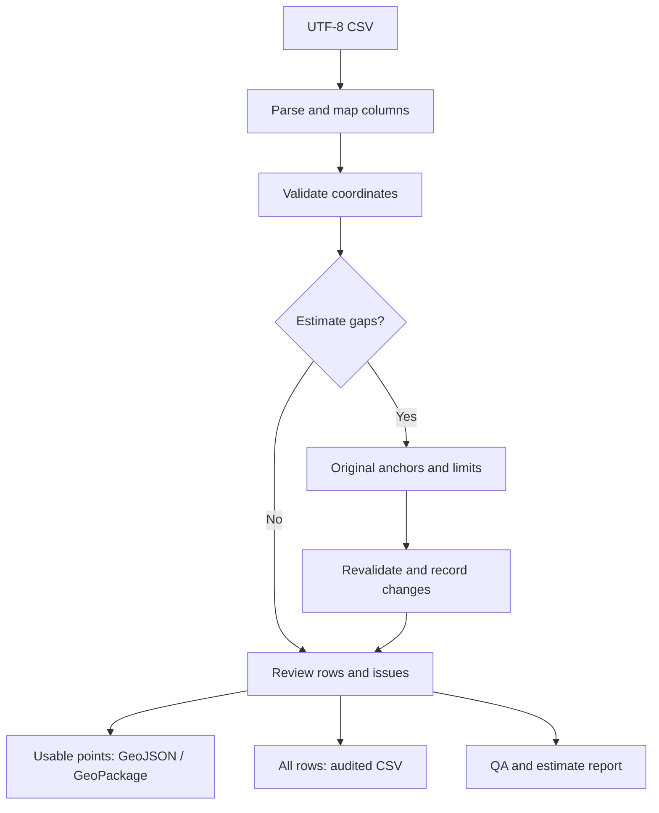

# Processing architecture

The browser UI and CLI use the same Python validation, interpolation and export functions. The dashboard is a local front end, not a hosted service.

## Boundaries

- The UI sends CSV text and explicit column selections to the local API. It never sends a server filesystem path.
- The API only accepts bounded JSON POST bodies with the dashboard request header. No CORS access is granted.
- Source records are copied for interpolation. Coordinates in the original table remain unchanged.
- Filename sequence identities include the folder, prefix, extension and any configured grouping fields. URL hosts are part of the identity; query strings are ignored.
- Original valid readings are the only interpolation anchors. A duplicate sequence makes the entire series ambiguous for estimation.
- All outputs share the same report and coordinate interpretation. GIS writers exclude unusable coordinates, while CSV preserves all rows.
- The browser snapshots the last successfully analyzed settings. Downloads use that snapshot even if a user changes the controls without applying them.

## Design choices

**Standard library runtime.** CSV parsing, JSON serialization, SQLite, binary geometry encoding, HTTP serving and unit tests are implemented with Python's standard library. This keeps local setup simple and makes the narrow export contract explicit.

**Point-only GeoPackage.** The writer handles one EPSG:4326 2D point layer. A general geometry or CRS engine is outside this version's scope. Expanding to polygons or other coordinate systems should use a proven geometry / projection library and additional interoperability tests.

**Visible estimates.** The status `estimated` and the separate audit distinguish inferred coordinates from original readings. A reviewer can reset estimates, tighten limits, or keep only original points using the exported status field.

**No basemap.** The dashboard draws a longitude / latitude scatter plot. It does not suggest street-level accuracy or contact a map provider.

**Request limits.** The in-memory app is capped at 5 MiB and 50,000 records. A larger workload would benefit from streaming ingestion, bounded workers and a spatial index.
